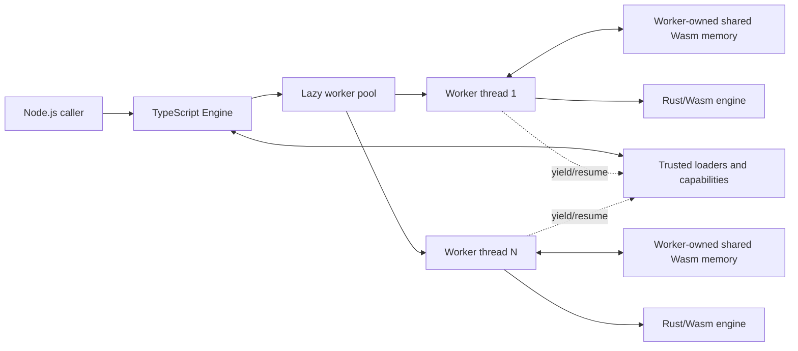

# Architecture

## Purpose

Nunjitsu is a Node.js template engine implemented in Rust, compiled to WebAssembly,
and executed in Node worker threads. It targets the observable template and
runtime behavior of Nunjucks 3.2.4 while replacing Nunjucks's JavaScript API
with an asynchronous, typed API.

The design prioritizes:

- safe execution of untrusted templates;
- low retained memory for templates rendered infrequently;
- compact, data-driven execution in shared Wasm memory;
- one-shot compilation and rendering rather than precompilation or persistent
  compiled-template caches; and
- an attributed, auditable compatibility suite derived from upstream tests.

Throughput for repeatedly rendered templates is secondary to predictable
resource use and low retention.

## System boundaries



### TypeScript engine

The engine is the public lifetime boundary. It owns:

- an immutable registry of loaders, filters, tests, globals, and declarative
  extension schemas;
- the compiled Wasm module and a lazy, bounded worker pool;
- queueing, cancellation, capability dispatch, output collection, and explicit
  disposal; and
- encoding safe input values into worker memory and decoding results.

Node-specific APIs may be used throughout this layer. Browser support is not a
current goal and must not constrain the Node implementation.

### Worker

Each worker owns one shared `WebAssembly.Memory` and one Wasm instance. The
memory is shared between the Node main thread and that worker, but is not shared
with other workers. A worker executes exactly one render at a time and remains
reserved while that render is suspended on a trusted host capability.

### Rust/Wasm engine

One Rust crate under `rust/` contains the parser, evaluator, fixed memory model,
resource accounting, and raw Wasm ABI. Logical modules must keep domain logic
separate from ABI handling even though they live in one crate. The same crate
must remain testable natively where behavior does not depend on Wasm.

The Rust source is organized by responsibility within those logical modules:

- `expression/` owns expression syntax, arguments, atoms, and directive calls;
- `template/` owns template boundaries, syntax scanning, and rendering helpers;
- `wasm/runtime/` owns the ABI and suspended render control flow;
- `wasm/evaluation/` owns continuations, expression evaluation, and output;
- `wasm/filters/` groups built-in filters by behavior; and
- `wasm/model/` owns registries, values, slots, and typed storage arrays.

The three `mod.rs` files are assembly points. Their included source files share
the parent module's privacy boundary, which keeps tightly coupled storage and
evaluator internals private without concentrating unrelated responsibilities in
single large files.

## Render lifecycle

A render is an isolated unit of ownership:

1. The TypeScript engine assigns an idle worker and creates a render-local
   capability namespace.
2. The host encodes context slots and UTF-16 entry-template code units directly
   into reserved ranges of that worker's fixed shared memory. Rust validates
   and freezes the submitted cursors. Named templates are obtained only through
   explicitly configured loaders and follow the same ownership transfer.
3. Rust parses and evaluates ordinary nodes as a stream. It retains compact AST
   slots only for bodies that must execute later or repeatedly, such as
   macros, blocks, loops, and inheritance overrides.
4. A loader, host capability, or string query yields an explicit evaluator
   continuation. Loader requests carry the current source's canonical identity
   so relative dependencies resolve correctly through deferred frames. The
   worker remains reserved, and the main thread resumes it after encoding the
   response.
5. Wasm emits fixed-size descriptors containing a host string handle and UTF-16
   range through a circular output array. Buffered rendering joins the drained
   ranges; streaming rendering exposes them with backpressure.
6. Completion, failure, or cancellation invalidates every render-local slot,
   range, continuation, and host string handle, then resets all logical cursors
   wholesale. Template sources, AST slots, context values, evaluation frames,
   and output descriptors are never cached across renders.

The worker, Wasm instance, and configured fixed capacity may be retained. Its
memory is allocated once when the worker is created and does not grow in
response to a render.

## Repository boundary

The TypeScript/npm package lives at the repository root. The single Rust crate
lives under `rust/`. The attributed, language-neutral compatibility corpus
lives under `tests/compat/` and is consumed by both implementation layers.

Planned ownership is:

```text
.
├── src/                 TypeScript public API, engine, and worker host
├── rust/                Single Rust engine and Wasm ABI crate
├── tests/
│   └── compat/          Shared Nunjucks v3.2.4 corpus and parity manifest
├── docs/                Normative architecture documentation
├── AGENTS.md            Project-wide contribution constraints
└── README.md            Introduction and minimal setup
```

Build artifacts, generated declarations, and copied upstream materials must be
clearly separated from authored source.

## Architectural non-goals

- A Nunjucks-compatible JavaScript API.
- Browser support.
- A precompiler or persistent compiled-template cache.
- Implicit filesystem access relative to the process working directory.
- Live proxying of arbitrary JavaScript object graphs into templates.
- Arbitrary JavaScript parser extensions for custom tags.
- Custom lexer delimiters or public lexer-token and parser-AST APIs.

See the area documents for the rationale and exact boundaries.
