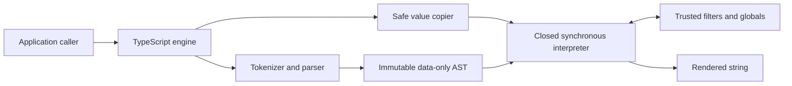

# Architecture

## Purpose

Nunjitsu is a native TypeScript renderer for a simpler Nunjucks subset,
optimized for secure direct string templating. It replaces generated-JavaScript
template execution with a closed interpreter.

The design prioritizes, in order:

1. preventing untrusted template source from gaining JavaScript execution or
   ambient access to the Node.js process;
2. compatibility with direct string templates and expressions;
3. a small, auditable synchronous API; and
4. low retained memory for one-shot rendering.

Security takes precedence over compatibility and performance when those goals
conflict.

## System boundaries

### Engine

`createEngine` synchronously constructs an immutable registry of filters and
globals. `render` accepts one inline source string and returns one string.
`prepareContext` optionally copies reusable caller data into an opaque
engine-bound snapshot; immutable path updates derive new snapshots with
structural sharing. Nunjitsu has no loaders, filesystem access, streams,
workers, Wasm modules, or resources requiring disposal.

Filter registry keys contain one or more dot-separated identifier segments.
The complete string is one capability ID: parser dots do not create property
lookups or namespaces, and every segment is checked against reserved names.
Global registry keys remain single identifiers.

Applications supply strings directly and perform any file discovery, path
policy, and reads before invoking the renderer. Path traversal, symbolic links,
archive extraction, and filesystem races are therefore outside the template
execution boundary.

### Parser

The native parser makes a single-pass scan over each complete template,
tokenizes expressions, and uses a closed precedence parser for the supported
grammar. It does not invoke Nunjucks, a JavaScript-language parser, generated
JavaScript, or host behavior. It constructs frozen discriminated-union object
nodes with stable direct properties and child references. There is no generic
foreign-node conversion boundary or packed numeric arena.

The scanner keeps template-data and code whitespace separate. Explicit trim
controls and `lstripBlocks` recognize the full ECMAScript whitespace set, while
code tokens accept only space, tab, LF, CR, and NBSP. Raw and verbatim scanning
tracks same-name nesting depth; mixed marker names remain literal content and
only an ordinary, non-hyphenated matching closing marker ends the outer region.
Once inside raw content, marker recognition uses the full template-data
whitespace set and treats either whitespace-control hyphen as literal text.

Default variables use `${{` and `}}` delimiters. Cookiecutter mode
uses `{{` and `}}` with the supported Jinja compatibility behavior. Block and
comment delimiters remain `` and `{# ... #}`.

Conditional blocks accept both `elif` and `elseif` as equivalent expression-
bearing continuations. `else if` remains invalid structural syntax, and every
branch is parsed before evaluator construction even when it cannot execute.

Structural delimiter, keyword, assignment, and executable-tag-end discovery
share one balanced code scanner. It skips strings with the pinned escape rules
and skips only exact identifier-boundary `r/` literals through the parser-owned
regex scanner. Parentheses inside a regex therefore cannot close a call-block
caller signature, while division expressions remain ordinary code. Comment
contents use a separate opaque scan to the first exact `#}`; quotes,
backslashes, and nested-looking openers have no syntax inside them.

Synchronous filter blocks reuse the ordinary expression-filter path. The
parser represents their body as an immutable `Capture` passed as the first
argument to a `Filter` inside `Output`; it does not introduce a callback or a
second dispatch mechanism. `endfilter` is an empty structural tag.

The complete inline source is parsed before execution. The parser charges the
AST-node resource limit as it creates each node, rejects template-loading tags
(`include`, `import`, `from`, and `extends`) and extensions, and freezes every
node and child collection. The AST is owned by one render and discarded when
that render ends. Call blocks have a dedicated node and accept only direct
symbols or static constant-key lookup chains as targets; effectful target
expressions are rejected during this complete parse.

### Interpreter

The interpreter evaluates the AST directly over engine-owned values and
map-backed scopes. Identifiers, attributes, indices, operators, coercions,
comparisons, and calls are explicit operations over closed value variants.
They never delegate to JavaScript property lookup or implicit object coercion.

The only callable values are sealed interpreter variants for inline macros,
built-ins, and registered global functions. A template value cannot contain a
JavaScript function or constructor. Calls always evaluate their target through
normal scope and closed-value lookup before dispatch. Registered capabilities
carry an evaluator-owned identity mapped privately to one exact host callback;
call-site syntax never selects host authority.

Macro binding uses a static slot plan, runtime value frames, and shared exports
as separate layers. After parsing and before evaluation, the planner follows
the pinned compiler's declaration traversal and assigns data-only numeric slot
IDs to direct declarations and references. Every compiled-function-equivalent
frame allocates its slots as `undefined`; executing a declaration initializes
only its exact slot. Inactive declarations therefore still shadow context and
capabilities, while duplicate declarations retain source-ordered slot identity.

Root, standalone block, ordinary macro, synthetic caller, and loop bodies have
explicit visibility boundaries. `if` and `switch` share their containing plan.
Loops inherit outer direct slots and store their own direct and control
temporaries in the enclosing compiled-function invocation, so repeated entry
does not reset generated `var` state. Multi-target array and record branches
have distinct visibility plans, with `else` using the record plan. Synthetic
callers retain their confined call-site slots, and blocks or ordinary macros
resolve otherwise-unbound names through runtime frames and current exports.
Positional formals and loop targets are direct slots; defaulted formals and loop
metadata remain runtime bindings.
Defaulted synthetic-caller formals preserve any inherited call-site direct
mapping instead of replacing it with their runtime binding. Assignment
preserves an existing direct slot independently of the assigned value kind. A
single target named `loop` is rejected because upstream mutates that iteration
value to install metadata; multi-target `loop` bindings remain ordinary direct
slots.

Operation validation precedes attacker-controlled operands. Call blocks resolve
and require a macro before evaluating arguments or registering their caller
body. Filter and test names, including tests named through `select` and
`reject`, must resolve before the corresponding input or argument expressions
can run. `selectattr` and `rejectattr` do not dispatch tests; they evaluate and
safe-check surplus arguments before ignoring them. Non-macro targets also
establish their positional and keyword policy before evaluating unsupported
arguments, then recursively reject callable authority from every accepted value
before dispatch.

Filter blocks resolve the exact built-in or registered filter and establish its
keyword policy before capturing their body. For a valid invocation, body
statements execute into the capture first, explicit filter arguments execute
afterwards in source order, and the ordinary filter dispatcher receives the
captured string as its input.

## Render lifecycle

1. The caller supplies inline source and either a `TemplateContext` or an
   explicitly retained prepared snapshot.
2. Plain context input is copied and validated into the closed value graph;
   prepared input reuses its already validated graph.
3. The complete source is parsed into a data-only AST.
4. The synchronous interpreter evaluates the AST with cooperative limits.
5. Trusted filter and global calls enter with empty host legacy RegExp capture
   state, receive copied public values, return through the same validator, and
   leave through a `finally` block that clears the state again.
6. A render-level `finally` block repeats the legacy RegExp reset as defense in
   depth on both success and failure.
7. The final string is returned, or the structured failure is thrown.
8. The AST, scopes, one-shot values, and output state become unreachable.
   Prepared context values remain reachable only through caller-held snapshots.

## Package architecture

The package is authored as one erasable TypeScript source tree targeting
Node.js 22 or newer. The build produces equivalent tested ESM and CommonJS
entrypoints and declarations from the same format-neutral source entrypoint.
Runtime behavior must not vary with the consuming module format.

The root README owns the complete consumer-facing TypeScript API reference.
This documentation directory owns implementation rationale, security
constraints, compatibility policy, and other architectural decisions.

## Architectural non-goals

- Complete Nunjucks template or JavaScript API parity.
- Includes, imports, inheritance, or any template loader.
- Browser support.
- Streaming or asynchronous filters, globals, or rendering.
- A JavaScript or `vm`-based template sandbox.
- Live proxying of arbitrary JavaScript object graphs into templates.
- Calling context functions or object methods.
- Host-defined tests or custom parser tags.
- A precompiler or persistent compiled-template cache.
- Arbitrary delimiter configuration.
- Sanitizing template-authored output for a downstream sink.
