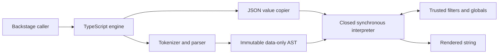

# Architecture

## Purpose

Nunjitsu is a native TypeScript renderer for the Nunjucks behavior exposed by
Backstage's scaffolder backend. It replaces the generated-JavaScript Nunjucks
runtime and `isolated-vm` boundary with a closed interpreter.

The design prioritizes, in order:

1. preventing untrusted template source from gaining JavaScript execution or
   ambient access to the Node.js process;
2. compatibility with Backstage scaffolder templates and expressions;
3. a small, auditable synchronous API; and
4. low retained memory for one-shot rendering.

Security takes precedence over compatibility and performance when those goals
conflict.

## System boundaries

### Engine

`createEngine` synchronously constructs an immutable registry of filters and
globals. `render` accepts one inline source string and returns one string.
`prepareContext` optionally copies reusable caller data into an opaque
engine-bound snapshot; immutable path updates derive new snapshots with
structural sharing. Nunjitsu has no loaders, filesystem access, streams,
workers, Wasm modules, or resource to dispose.

Backstage discovers and reads files outside the renderer, applies workspace
path policy there, and renders each text file independently. Keeping that model
means path traversal, symbolic links, archive extraction, and filesystem races
are not part of the template execution boundary.

### Parser

The parser uses the lockfile-pinned Nunjucks 3.2.4 grammar as trusted input to a
strict conversion boundary. It does not invoke a JavaScript-language parser,
generate JavaScript, or evaluate source. The converter copies allowlisted nodes
into a complete immutable AST containing only data.

Default variables use Backstage's `${{` and `}}` delimiters. Cookiecutter mode
uses `{{` and `}}` with the supported Jinja compatibility behavior. Block and
comment delimiters remain `` and `{# ... #}`.

The complete inline source is parsed before execution. Template-loading nodes
(`include`, `import`, `from`, and `extends`) and extension nodes are rejected.
The AST is owned by one render and discarded when that render ends.

### Interpreter

The interpreter evaluates the AST directly over engine-owned values and
map-backed scopes. Identifiers, attributes, indices, operators, coercions,
comparisons, and calls are explicit operations over closed value variants.
They never delegate to JavaScript property lookup or implicit object coercion.

The only callable values are sealed interpreter variants for inline macros,
built-ins, and registered global functions. A template value cannot contain a
JavaScript function or constructor.

## Render lifecycle

1. The caller supplies inline source and either a JSON-compatible context or an
   explicitly retained prepared snapshot.
2. Plain context input is copied and validated into the closed value graph;
   prepared input reuses its already validated graph.
3. The complete source is parsed into a data-only AST.
4. The synchronous interpreter evaluates the AST with cooperative limits.
5. Trusted filter and global calls receive copied JSON-compatible values, and
   their results cross the same validator.
6. The final string is returned.
7. The AST, scopes, one-shot values, and output state become unreachable.
   Prepared context values remain reachable only through caller-held snapshots.

## Architectural non-goals

- Complete Nunjucks template or JavaScript API parity.
- Includes, imports, inheritance, or any template loader.
- Browser support.
- Streaming or asynchronous filters, globals, or rendering.
- A JavaScript or `vm`-based template sandbox.
- Live proxying of arbitrary JavaScript object graphs into templates.
- Calling context functions or object methods.
- Host-defined tests or custom parser tags.
- A precompiler or persistent compiled-template cache.
- Arbitrary delimiter configuration.
- Sanitizing template-authored output for a downstream sink.
