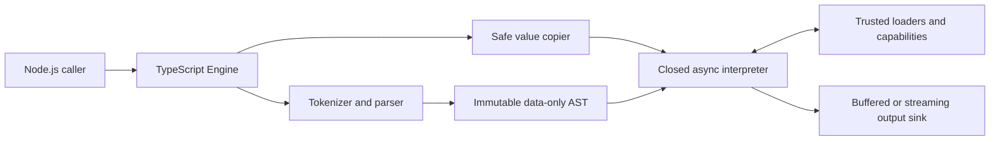

# Architecture

## Purpose

Nunjitsu is a native TypeScript template engine for Node.js. It targets the
observable template and runtime behavior of Nunjucks 3.2.4 while replacing the
Nunjucks JavaScript API with an asynchronous, typed API.

The design prioritizes, in order:

1. preventing untrusted template source from gaining JavaScript execution or
   ambient access to the Node.js process;
2. compatibility with existing Nunjucks templates inside that security model;
3. clear, auditable implementation boundaries; and
4. acceptable one-shot rendering performance without precompilation or a
   persistent compiled-template cache.

Security takes precedence over compatibility and performance when those goals
conflict.

## System boundaries



### Engine

`createEngine` synchronously constructs an immutable registry of loaders,
filters, tests, globals, and declarative custom tags. Rendering is asynchronous
because loaders and capabilities may be asynchronous. A direct interpreter has
no mandatory worker, Wasm module, or process resource to dispose.

### Parser

The parser uses the lockfile-pinned Nunjucks 3.2.4 grammar as trusted input to a
strict conversion boundary. It does not invoke a JavaScript-language parser,
generate JavaScript, or evaluate source. The converter recognizes an exhaustive
node allowlist and immediately copies the result into a complete immutable AST
composed only of discriminated data nodes, primitive fields, child arrays, and
source spans. Foreign nodes, executable fields, functions, host objects, and
property descriptors are rejected.

Every loaded template is fully parsed and validated before it executes. The AST
is owned by one render and discarded when that render ends. Nunjitsu does not
precompile templates or retain parsed templates across renders by default.

### Interpreter

The interpreter evaluates the closed AST directly in the caller process. It
operates only on engine-owned values and scopes. Identifiers, attributes,
indices, operators, coercions, comparisons, and calls are implemented as
explicit operations over that model; they never delegate to JavaScript
property lookup or implicit object coercion.

The only callable values are sealed interpreter variants for macros, built-in
callables, and registered capability identities. A template value can never
contain a JavaScript function or constructor.

## Render lifecycle

1. The engine resolves the entry source through an explicit loader or accepts
   inline source.
2. Context input is copied and validated into the closed value graph.
3. The complete source is parsed into a data-only AST.
4. The async interpreter evaluates the AST using map-backed scopes and explicit
   operations. Includes, imports, and inheritance load and parse dependencies
   on demand within the same render.
5. Trusted capability calls receive copied public values. Their results cross
   the same value validator before evaluation resumes.
6. Output is written to a render-owned buffered or streaming sink.
7. The AST, scopes, values, loader cache, and capability state become
   unreachable when the render completes, fails, or is cancelled.

## Repository boundary

The authored package lives at the repository root:

```text
.
├── src/
│   ├── parser/           Tokenizer and closed template/expression parser
│   ├── runtime/          Values, scopes, interpreter, output, and limits
│   └── ...               Public API, loaders, and capabilities
├── tests/
│   └── compat/           Shared Nunjucks v3.2.4 corpus and parity manifest
├── docs/                 Normative architecture documentation
├── AGENTS.md             Project-wide contribution constraints
└── README.md             Introduction and minimal setup
```

The runtime contains no Rust, WebAssembly, shared-memory ABI, worker protocol,
or generated JavaScript evaluator.

## Architectural non-goals

- A Nunjucks-compatible JavaScript API.
- Browser support.
- A JavaScript or `vm`-based template sandbox.
- Live proxying of arbitrary JavaScript object graphs into templates.
- Calling context functions or object methods.
- A precompiler or persistent compiled-template cache.
- Implicit filesystem access relative to the process working directory.
- Arbitrary JavaScript parser extensions for custom tags.
- Custom lexer delimiters or public lexer-token and parser-AST APIs.
- Sanitizing template-authored output for a particular downstream sink.

See the area documents for the rationale and exact boundaries.
