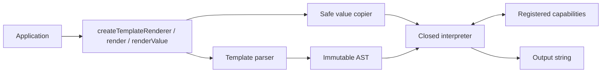

# Architecture

Nunjitsu is a synchronous, inline template renderer for Node.js. Its defining
design choice is a closed TypeScript interpreter: templates are parsed as data
and evaluated without generating or executing JavaScript.

Security is the first priority, followed by compatibility with the supported
direct-string subset of Nunjucks, a small public API, and low retained memory
for templates that may render only once.

## Mental model

The application supplies an inline source string and plain data. The parser
validates the complete source before evaluation and produces an immutable,
data-only abstract syntax tree. Context data is copied into renderer-owned
values. The interpreter then performs lookup, coercion, control flow,
filtering, and output explicitly over those known value kinds.

Templates never receive a live JavaScript object or function. Application code
can be invoked only through filters and globals registered when the renderer is
created.

## Render lifecycle

One call to `render` or `renderValue` follows this sequence:

1. Validate the source, context, prepared-context ownership, and limit options.
2. Copy ordinary context data into the closed value model.
3. Parse and validate the complete template.
4. Allocate render-local scopes and evaluator state.
5. Evaluate the AST and append output fragments.
6. Return the final string or safely copied native value, or throw without
   returning partial output.
7. Release the source, AST, scopes, and one-shot values.

Nothing is compiled to JavaScript, sent to a worker, or retained as a template
cache. The next render starts from fresh parser and evaluator state.

## Main modules

### Public renderer

`createTemplateRenderer` owns immutable filter and global registries plus
delimiter and whitespace options. `render` always returns text. `renderValue`
preserves the public value of a sole interpolation and otherwise returns text.
`prepareContext` creates an optional immutable snapshot for applications that
repeatedly render against mostly unchanged data.

### Parser

The parser scans template data, statements, comments, and expressions directly.
It produces frozen object nodes with explicit variants and child references.
Parsing does not call Nunjucks or a JavaScript parser, and malformed syntax is
rejected before template evaluation begins.

### Closed values and interpreter

The runtime has explicit representations for primitives, arrays, records, safe
strings, regular expressions, and sealed callable identities. Scopes and
records are map-backed. Operations such as property lookup, truthiness,
comparison, addition, iteration, and calls dispatch by runtime value kind rather
than falling through to JavaScript objects or prototypes.

### Capabilities

Registered filters and globals are trusted application capabilities. The
interpreter stores opaque callable identities, not callback functions. Values
are copied out to the callback and copied back into the runtime, keeping the
application object graph separate from template-visible state.

## Ownership and memory

Normal renders retain no template state. Prepared contexts are the one explicit
exception: they retain a renderer-owned copy of context data until the caller
releases the snapshot. `withPath` creates a new snapshot while structurally
sharing unchanged internal values.

Resource limits bound logical parser and evaluator work, output, nesting, and
capability calls. They reduce denial-of-service risk but do not provide process
isolation or exact heap and CPU accounting. See [Security](security.md) for the
operational model and defaults.

## Package layout

- `src/` contains the public API, parser, safe values, interpreter, and built-ins.
- `tests/source/` exercises source TypeScript directly.
- `tests/compat/` contains the attributed Nunjucks compatibility corpus.
- `tests/package/` validates built ESM, CommonJS, and declaration entrypoints.
- `benchmarks/` compares inline rendering with pinned Nunjucks.
- `scripts/` contains compatibility and release tooling.

One erasable TypeScript source tree produces equivalent ESM and CommonJS builds
with rolled-up public declarations. Runtime behavior must not depend on module
format.

## Deliberate non-goals

Nunjitsu does not provide template loading, inheritance, browser support,
streaming, asynchronous rendering, precompilation, persistent compiled caches,
custom parser extensions, or the Nunjucks JavaScript API. Applications own any
filesystem access before passing a source string to the renderer.

For exact implementation invariants, see [`CONTEXT.md`](../CONTEXT.md).
